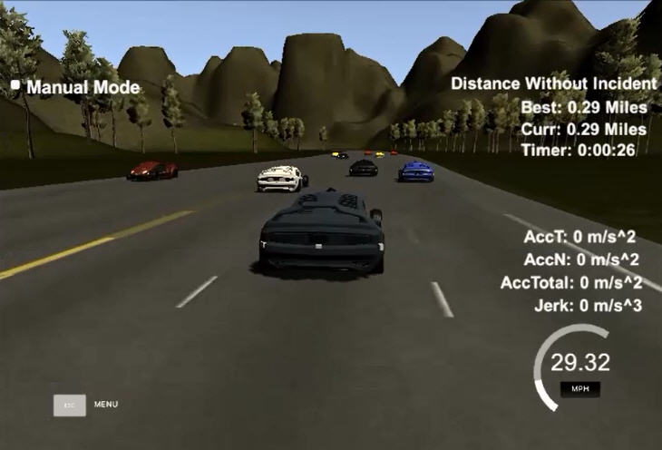
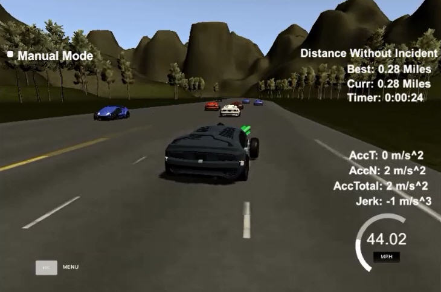
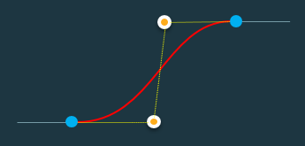
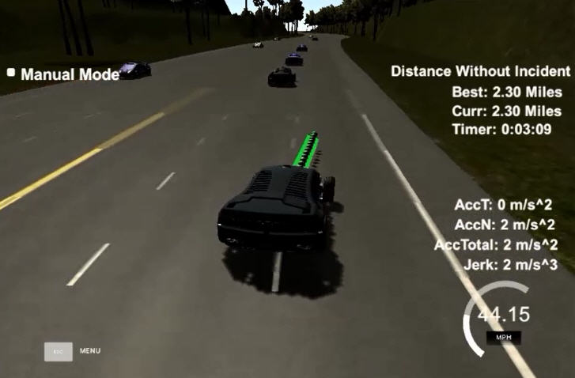

# Self-Driving Car Path Planning #

## Specifications ##
The goal of this project is to design a path planner and trajectory generator functions to drive the car along a highway without colliding with other cars and without violating predefined dynamic limits.

The trajectory constraints are maximum speed, acceleration, and jerk. The path constraints are the highway lanes and the presence of other cars.
Sensor fusion data is used to detect and predict the current and future positions of other vehicles.

## Implementation ##

The path planner is implemented in C++ in the main.cpp file. All required helper functions are included in the same file.

## Code explanation ##

The code consists of a main cyclic logic control with the addition of some helper functions. We break up and analyze all the individual parts here.

**Frenet to Cartesian conversions**

While the simulator uses Cartesian coordinates to describe the position of all vehicles around the track, it is often useful to use Frenet coordinates for quick calculations.
For example, when predicting the position of a car in the future it is much easier to increment the s coordinate, instead of figuring it out directly in the x,y space. The curvature of the track would make it quite complicated.

A helper function getXY is already provided to convert a generic (s,d) point into the corresponding (x,y) point. The waypoints around the track are used as reference points for the transformation.

**Detection of other cars**

In order to avoid collisions with other cars we cyclically check for sensor fusion data:

    //detect other cars
    for (int i=0;i<sensor_fusion.size();i++) {			
		//check lane of each car
		float d = sensor_fusion[i][6];

If we happen to find cars in the same lane that we occupy we check for possible collision detection, by comparing the future position of our car with the future position of the other vehicle. By “future position” we mean the position predicted to be occupied at a specific target distance (30 meters in our code) assuming a constant velocity.

The flag “too_close” is raised if a collision in our lane is predicted within the next 30 meters. The speed of the preceding vehicle is recorded, so that we can slow down accordingly in case we get stuck behind.

	if (check_car_s > car_s && check_car_s < car_s+target_distance && check_car_speed < car_speed) {
		//car will collide -> slow down!
		too_close = true;
		max_speed = check_car_speed;
	}

We then do the same for the left and right adjacent lanes, with a safety margin of 30 meters ahead and behind our cars, to check if the lanes are free for a possible lane change maneuver:

	if (check_car_s > car_s-target_distance && check_car_s < car_s+target_distance) {
		left_free = false; //left lane is occupied!
	}

**Main control logic**

Once we have a clear view of the situation of the lanes surrounding our car we can plan a simple target position.

The following conditions are checked:

1.	If a collision is predicted ahead we either move to an adjacent lane (if any is free) or we slow down to the speed of the preceding car.
2.	If no collision is predicted we can speed up to maximum speed, and we can also try to return to the middle lane in case we are not in it. Staying in the middle lane gives us more freedom of movement in the future.
	
		//main control logic
		if (too_close) { //collision ahead
			//look for lane change or slow down
			if (right_free && lane<2) lane+=1;
			else if (left_free && lane>0) lane-=1;
			else if (ref_vel > max_speed) ref_vel -= 0.5;
		} else { //no collision ahead
			//speed up to limit
			if (ref_vel < 22) { //22m/s is a bit less than 50mph
				ref_vel += 0.5;
			}
			//try to stay in middle lane
			if (lane>1 && left_free) lane-=1;
			if (lane<1 && right_free) lane+=1;
		}

This control logic is very simple but works well enough to navigate the highway.

**Path planner**

Now we have a target point ahead of us, with a given speed and a given lane. The path planner need to connect the current position of the car with that target position. We use the cubic Bezier curve to do that smoothly.

Four control points are required to describe such a curve. The starting direction will be tangential to the segment defined by the first two points, while the ending direction will be tangential to the segment defined by the last two points. The curve passes through the first and last point, not the two middle control points:

 
The equation of the curve is:

P=(1-t)^3 P_0+3(1-t)^2 tP_1+3(1-t) t^2 P_2+t^3 P_3

The curve is described parametrically by moving t from 0 to 1. In order to evaluate the curve at a specific time t in a computationally stable way we use De Casteljau’s method implemented in the *EvaluateBezier* function:

	//evaluate the Bezier curve defined by control points CtrlPoints at time t
	Point_Type EvaluateBezier(const vector<Point_Type> CtrlPoints, double t) {
		int k,i;
		int n = 3; //order of spline (3=cubic; 4=quartic...)
	
		if(t<=0) return CtrlPoints[0];
		if(t>=1) return CtrlPoints[n];
		
		vector<Point_Type> Point;	
		for(i=0;i<=n;i++) Point.push_back(CtrlPoints[i]);
		
		for (k=1; k<=n; k++) {
			for (i=0; i<=n-k; i++) {
				Point[i].x = (1.0-t)*Point[i].x + t*Point[i+1].x;
				Point[i].y = (1.0-t)*Point[i].y + t*Point[i+1].y;
			}
		}
		
		return Point[0];
	}

The function *BezierLength* is provided to calculate an approximate length of the curve, using linear approximations:

	//calculate (approximate) length of Bezier curve
	double BezierLength(const vector<Point_Type> CtrlPoints)
	{
		vector<Point_Type> Point;
		int i;
		int k = 30; //increase number of points for more accuracy
		double Length = 0;
		
		Point.push_back(CtrlPoints[0]);
		Point.push_back(CtrlPoints[0]);
		
		//evaluate the BezierCurve at different points and then add the linear distances between them
		for(i=1;i<=k;i++) {
			Point[1] = EvaluateBezier(CtrlPoints,(double)(i)/(double)(k));
			double dx = Point[1].x - Point[0].x;
			double dy = Point[1].y - Point[0].y;
			Length += sqrt(dx*dx+dy*dy);
			Point[0] = Point[1];
		}
		return Length;
	}

The four control points used in our case are:

1.	Current position of car (or last planned position if available)
2.	Position of point 1 incremented by 1/3 of the target distance along the current direction
3.	Position 2/3 of the target distance, along the target lane
4.	Position at the target distance in the target lane.

Note that the curve is generated directly in the global Cartesian coordinate system. This makes the code much cleaner and avoids multiple coordinate transformations between local and global systems. The curve is described parametrically, not in the X,Y space, so evaluation of individual points is very easy.

The values 1/3 and 2/3 are purposely chosen so that the parametric curve is also uniform, that is: equal increments of the parameter t result in equal increments of the curve’s length. This property is important for time-dependent calculations.

We now calculate the length of the curve and the time it takes to run it at the current target speed. Note that the length calculation is only an approximation due to the linearization technique, so we increase the planned time by 10% to be on the safe side and prevent accidental speed limit violations.

The planned trajectory can now be generated and the points can be sent to the simulator. We generate a 0.5 seconds long trajectory, which is long enough to be smooth, but short enough to adapt quickly to changes in the environment. Given that the simulator considers one new position every 0.02 seconds, we pass a total of 25 points.

We first re-use whatever was left from the previously planned path not yet consumed by the simulator, then we add the points from the new curve, which starts tangentially to the old path.

	tmpPoint = EvaluateBezier(CtrlPoints,t);
	next_x_vals.push_back(tmpPoint.x);
	next_y_vals.push_back(tmpPoint.y);

## Comments ##

The car is able to run on the highway as required, without violating the defined constraint.

Note that the Bezier curve smooths the path between current and target point, but does not guarantee a trajectory within dynamic limits. However, by choosing a target point far away in time (30 meters at a maximum speed of 20m/s) we can easily make sure that acceleration and jerk constraints are not violated.

